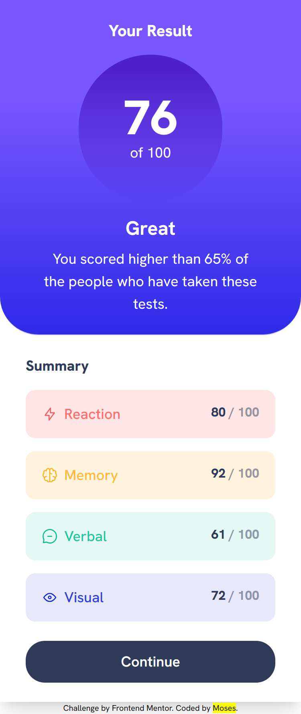

# Frontend Mentor - Results summary component solution

This is a solution to the [Results summary component challenge on Frontend Mentor](https://www.frontendmentor.io/challenges/results-summary-component-CE_K6s0maV). Frontend Mentor challenges help you improve your coding skills by building realistic projects.

## Table of contents

- [Overview](#overview)
  - [The challenge](#the-challenge)
  - [Screenshot](#screenshot)
  - [Links](#links)
- [My process](#my-process)
  - [Built with](#built-with)
  - [What I learned](#what-i-learned)
- [Author](#author)

## Overview

### The challenge

Users should be able to:

- View the optimal layout for the interface depending on their device's screen size
- See hover and focus states for all interactive elements on the page
- **Bonus**: Use the local JSON data to dynamically populate the content

### Screenshot



### Links

- Solution URL: [result-summary-component-repo](https://github.com/mbtenkorang/results-summary-component)
- Live Site URL: [result-summary-component-site](https://results-summary-component-fem.onrender.com)

## My process

### Built with

- Semantic HTML5 markup
- Flexbox
- CSS Grid
- Mobile-first workflow
- [VueJS](https://vuejs.org/) - JS Progressive Framework
- [Tailwindcss](https://tailwindcss.com/) - For styling
- [Vite](https://vitejs.dev/) - For bundling

### What I learned

The following CSS psuedo-class for targetting list items:

```css
:nth-child() {
}
```

Use [nth-child pusedo-class](https://developer.mozilla.org/en-US/docs/Web/CSS/:nth-child) to visit the reference information on [MDN](https://developer.mozilla.org/en-US/)

## Author

- Website - [Moses](https://github.com/mbtenkorang)
- Frontend Mentor - [@moses](https://www.frontendmentor.io/profile/mbtenkorag)
